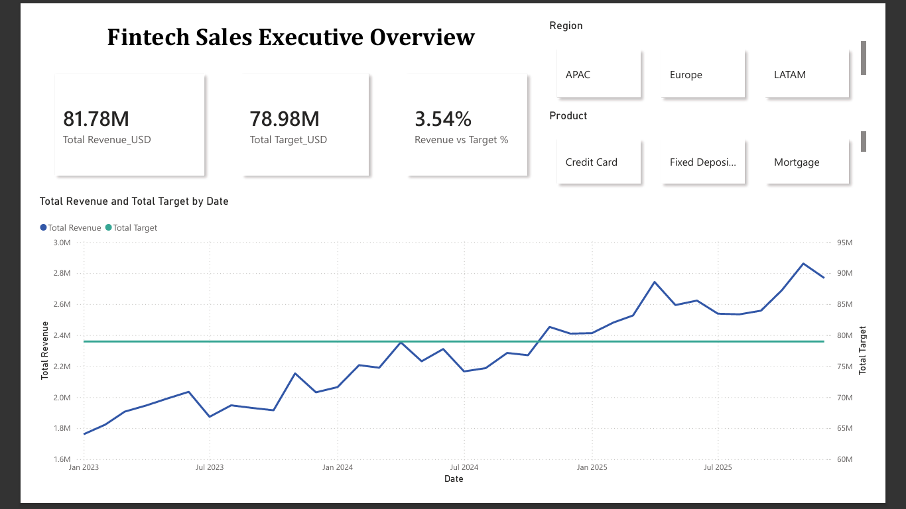
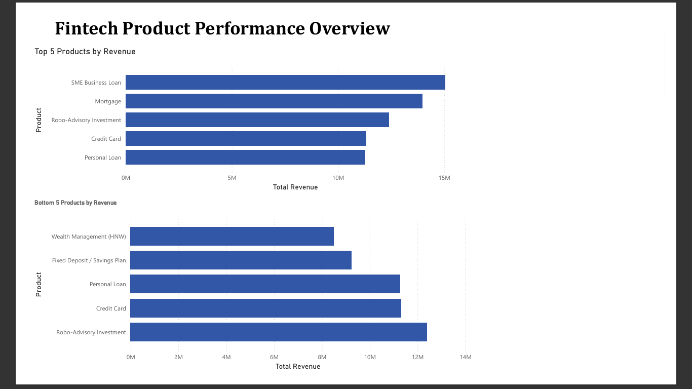
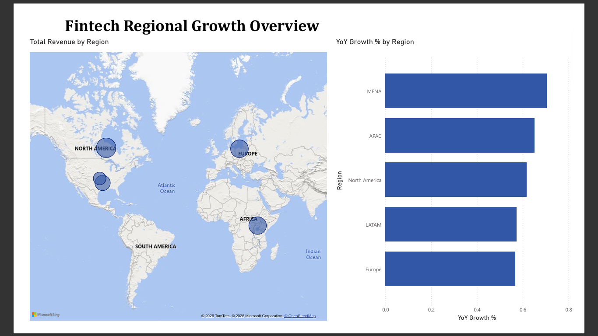

# 💳 Fintech Sales & Executive KPI Dashboard

## Objective

In this project, I designed and built an end-to-end BI reporting pipeline that replaces manual,
delayed executive reporting with a real-time, self-service dashboard:
1. Generated and validated a 3-year synthetic fintech transactional dataset (36 months, 5 regions, 7 products)
2. Cleaned and explored the data using Python (pandas) in Google Colab
3. Wrote SQL (SQLite) queries to answer core executive questions: top/bottom product performance,
   regional growth, and revenue vs target
4. Built an interactive 3-page Power BI dashboard for self-service executive reporting

## Table of Contents

- [Business Problem](#business-problem)
- [Dataset Used](#dataset-used)
- [Technologies](#technologies)
- [Data Pipeline Overview](#data-pipeline-overview)
- [Step 1: Data Cleaning & Exploration](#step-1-data-cleaning--exploration)
- [Step 2: SQL Analysis](#step-2-sql-analysis)
- [Step 3: Dashboard](#step-3-dashboard)
- [Key Insights](#key-insights)
- [Impact Statement](#impact-statement)

## Business Problem

Executives had no real-time visibility into which products, regions, and channels were driving
revenue — reporting relied on manual, delayed exports, slowing decisions on pricing, regional
investment, and product prioritization.

## Dataset Used

This project uses a fintech transactional dataset generated to mirror real-world
fintech product mix, seasonality, and regional distribution:
- 36 months of data (Jan 2023 – Dec 2025)
- 5 regions: North America, Europe, MENA, APAC, LATAM
- 7 products: Personal Loan, Credit Card, Mortgage, SME Business Loan, Robo-Advisory Investment,
  Fixed Deposit/Savings Plan, Wealth Management (HNW)
- 4 channels (Mobile App, Web Platform, Partner/Broker, Branch) and 4 customer segments
  (Retail, SME, Mass Affluent, Private/HNW)
- A companion monthly targets table for revenue-vs-target reporting

Files:
- Raw data: [`data/raw/fintech_sales_raw.csv`](data/raw/fintech_sales_raw.csv)
- Targets: [`data/raw/monthly_targets.csv`](data/raw/monthly_targets.csv)

## Technologies

The following technologies are used to build this project:
- Language: Python, SQL
- Cleaning & Exploration: Google Colab (pandas, matplotlib)
- Analysis: SQLite
- Dashboard: Power BI Desktop

## Data Pipeline Overview

Files by stage:
- Step 1: Cleaning & exploration — [`python/data_cleaning_eda.ipynb`](python/data_cleaning_eda.ipynb)
- Step 2: SQL analysis:
  - [`sql/01_top_bottom_products.sql`](sql/01_top_bottom_products.sql)
  - [`sql/02_region_growth_2023_vs_2025.sql`](sql/02_region_growth_2023_vs_2025.sql)
  - [`sql/03_monthly_trend_vs_target.sql`](sql/03_monthly_trend_vs_target.sql)
- Step 3: Dashboard — [`powerbi/Fintech_Sales_Executive_Dashboard.pbix`](powerbi/Fintech_Sales_Executive_Dashboard.pbix)

## Step 1: Data Cleaning & Exploration

In this step, I loaded the raw CSV into Google Colab and validated data quality prior to analysis:
1. Checked data types, null counts, and date range across all 36 months
2. Ran exploratory aggregations — total revenue by region and by product — to sanity-check the
   dataset before building SQL logic on top of it

Link to notebook: [`python/data_cleaning_eda.ipynb`](python/data_cleaning_eda.ipynb)

## Step 2: SQL Analysis

Using SQLite, I answered the three core executive questions:
1. **Top/Bottom 5 products by revenue** — ranked all 7 products by total revenue
2. **Region with highest growth** — compared 2023 vs 2025 revenue by region to calculate YoY growth %
3. **Monthly trend vs target** — joined actuals against Finance-set monthly targets by region

Link to scripts: [`sql/`](sql/)

## Step 3: Dashboard

After validating the SQL logic, I built a 3-page interactive Power BI dashboard:
- **Executive Overview** — KPI cards (Total Revenue, Total Target, Revenue vs Target %) and a
  monthly trend line vs target, with Region and Product slicers
- **Product Performance** — Top 5 and Bottom 5 products by revenue
- **Regional Growth** — revenue map by region and YoY growth % ranking

Link to dashboard file: [`powerbi/Fintech_Sales_Executive_Dashboard.pbix`](powerbi/Fintech_Sales_Executive_Dashboard.pbix)

## Key Insights

- Total revenue reached **$81.78M** against a **$78.98M** target — **+3.54%** ahead of plan
- **SME Business Loan** and **Mortgage** are the top 2 revenue-driving products;
  **Wealth Management (HNW)** is the lowest, reflecting its low-volume/high-touch nature
- **MENA** is the fastest-growing region, outpacing Europe and LATAM — signaling where future
  regional investment would compound fastest

## Impact Statement

This dashboard replaces manual, delayed reporting with real-time, self-service insight —
surfacing a fast-growing region (MENA) and a clear product hierarchy that can directly inform
pricing and regional investment decisions.
